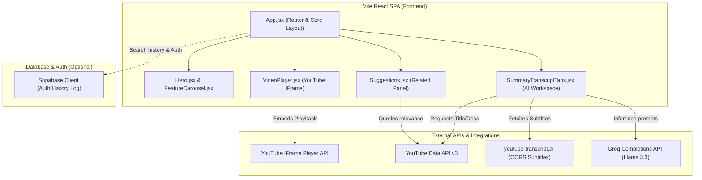

# System Architecture

This document describes the high-level architecture of Tubezip, including component hierarchy, data flows, and external services.

---

## Architecture Diagram

The diagram below maps how components, external APIs, and services interact:



---

## Architectural Breakdown

### 1. Frontend Client
Tubezip is structured as a **Vite-powered React Single Page Application (SPA)**. It runs entirely on the client browser.
- **Vite & React 19**: Scaffolded with Vite for instantaneous Hot Module Replacement (HMR) and optimized rollup compilation.
- **Tailwind CSS v4**: Utility styling that enables fully responsive layouts (mobile, tablet, desktop) without writing legacy CSS sheets.
- **Lucide React**: Clean, lightweight SVG icon package.

### 2. State & Data Flow
The application state flows downward:
1. **Video URL Submission**: User enters a link in `Searchbar` (Landing Page) or the dashboard header input box.
2. **Routing / State Update**: The URL is parsed to extract the unique 11-character YouTube video ID. The browser history is updated (`/learn/{videoId}`) and the application shifts from landing layout to dashboard layout.
3. **Parallel Ingestion**:
   - **VideoPlayer**: Mounts the YouTube IFrame player with autoplay enabled.
   - **SummaryTranscriptTabs**:
     - Fetches video details (Title/Desc) via YouTube Data API.
     - Downloads captions via `youtube-transcript.ai`.
     - Passes captions to Groq for summaries and translation.
   - **Suggestions**: Takes the video ID, pulls keywords, and queries YouTube Data API for relevant recommendations.

### 3. Integrations & API Services
- **YouTube IFrame Embed API**: Embeds the video directly into the interface using the standard, sandboxed player wrapper.
- **YouTube Data API v3**: Supplies video title/description fallbacks and relevant recommendation tags.
- **youtube-transcript.ai**: Solves CORS errors on the frontend client. It acts as an open subtitle aggregator, serving subtitle tracks as raw text.
- **Groq API**: Serves high-speed completions for summary generation, transcript translation, and video-content Q&A chat.
- **Supabase**: Integrated with Supabase JS client for authentication and persistent search logs.

---

## Component Hierarchy

```
App.jsx (Root Routing & Core Controller)
├── Navbar.jsx (Logo, Navigation & Global Home Reset)
├── Hero.jsx (Title & Link Ingestion)
│   ├── Searchbar.jsx (Submit Action & Input Validation)
│   └── FeatureCarousel.jsx (Automated visual tabs: Notes, Transcripts, Q&A, Export)
├── Features.jsx (Grid of benefit tags)
├── HowItWorks.jsx (Numbered step checklist)
├── VideoPlayer.jsx (Responsive IFrame player)
├── Suggestions.jsx (Related recommendations carousel)
├── SummaryTranscriptTabs.jsx (Workspace controller)
│   └── Tab Layouts
│       ├── Summary Panel (Markdown display, Notion/Txt exporter)
│       ├── Transcript Panel (Translation controller & raw captions)
│       └── Chat Panel (Conversational UI log & submit button)
└── Footer.jsx (Copyright links)
```

---

## Design Rationale

1. **Client-Side SPA Architecture**: By keeping the application client-side, we minimize server overhead, speed up load times, and let users communicate directly with API endpoints, resulting in lower operational latency.
2. **Tabbed Workspace**: Notes, transcripts, and AI chat are grouped into a single pane (`SummaryTranscriptTabs`) next to the player, allowing users to read, translate, or chat without losing focus on the video.
3. **Modular Dashboard Layout**: Separating features into isolated files (e.g., `VideoPlayer`, `Suggestions`, `SummaryTranscriptTabs`) makes it easy to add features (like saving files to Notion or adding Supabase logs) without risk to core systems.
