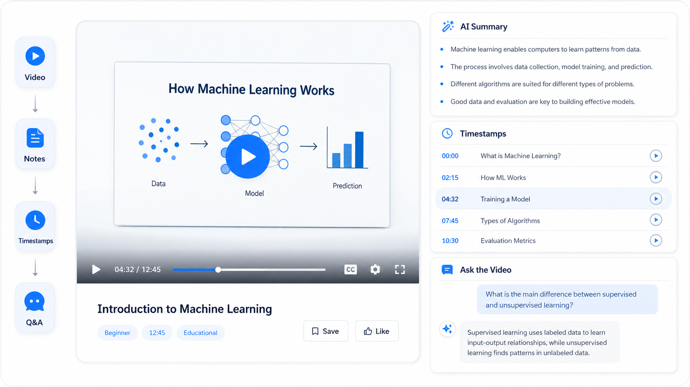

# Tubezip

**Live Demo:** [tubezipp.netlify.app](https://tubezipp.netlify.app)
[](LICENSE)
[](https://react.dev/)
[](https://vitejs.dev/)
[](https://tailwindcss.com/)
[](https://groq.com/)

**Tubezip** is a premium, AI-powered YouTube learning assistant that converts long educational videos, podcasts, and lectures into structured study guides, interactive timestamps, and translations in seconds. Users can also chat directly with the video context to clarify concepts, extract code snippets, and export summaries instantly.

---

## Problem Statement

In the age of online learning, video lectures and tutorials are the primary resources for self-education. However, video is a linear and inefficient medium for learning:
- **Algorithms & Distractions**: Recommender systems push clickbait instead of focused educational follow-ups.
- **Wasted Time**: Users spend hours scrubbing timelines to find a single code snippet, diagram, or definition.
- **Language Barriers**: High-quality tutorials in foreign languages (or localized dialects like Hindi/Hinglish) are hard to translate while retaining timestamps.
- **Passive Viewing**: Passive video consumption leads to lower retention compared to active reading and Q&A.

### Why Existing Solutions Fail
1. **Generic Summarizers**: Translate localized dialects into pure, stiff English, losing contextual vocabulary and developer terminologies.
2. **Scraping Blockades**: Frontend tools scrape watch pages through public proxies, which YouTube regularly blocks with rate limits (429) or CAPTCHAs, rendering the tools unusable.
3. **No Direct Interactivity**: Static note generators do not let users query the video content dynamically to clarify gaps.

---

## Our Solution

**Tubezip** addresses these gaps by creating a modular, tabbed dashboard alongside the video:
- **Same-Language Smart Notes**: AI generates notes in the natural language of the video (including Hindi/Hinglish support), formatting key definitions and code blocks in markdown.
- **Stable Transcript Aggregation**: Pulls subtitles directly from a CORS-enabled endpoint, avoiding proxy time-outs.
- **Ask the Video**: A real-time Q&A assistant built with Llama 3.3 to answer user queries using the transcript as context.
- **Gap-Bridging Recommendations**: Bypasses the YouTube algorithm to suggest exactly 3 relevant videos targeting the video's topic.

---

## Tech Stack

| Layer | Technology | Purpose |
| :--- | :--- | :--- |
| **Frontend Core** | React 19, Vite 8 | UI Rendering & scaffolding |
| **Styling** | Tailwind CSS v4 | Responsive utility design |
| **AI Inference** | Groq API (Llama 3.3 70B) | Summary generation, translations, Q&A |
| **Subtitle Ingestion** | YouTube Transcript API | CORS-enabled subtitle extraction |
| **Metadata & Suggestions** | YouTube Data API v3 | Pulling video titles, descriptions, related tags |
| **Database & Auth** | Supabase JS client | User authentication and logs (ready) |

---

## Folder Structure

```
tubezip/
├── .vscode/               # Workspace settings
├── public/                # Logo, assets, and icons
├── src/
│   ├── components/
│   │   ├── common/        # Shared basic UI elements
│   │   ├── dashboard/     # Suggestions, VideoPlayer, SummaryTranscriptTabs
│   │   └── landing/       # Navbar, Hero, FeatureCarousel, Features, Footer
│   ├── lib/
│   │   └── supabase.js    # Supabase authentication integration
│   ├── App.css            # Custom CSS themes
│   ├── App.jsx            # Routing, control states, and layouts
│   ├── index.css          # Tailwind directives & utility overrides
│   └── main.jsx           # Vite bootstrapper
├── .env.example           # API template keys
├── ARCHITECTURE.md        # Architectural documentation
├── API.md                 # Integrated API schemas
├── CONTRIBUTING.md        # Open-source contributions guide
└── CHANGELOG.md           # Release histories
```

---

## Installation & Running Locally

### Prerequisites
- Node.js (v18 or higher)
- npm (v9 or higher)

### Setup Steps
1. **Clone the repository:**
   ```bash
   git clone https://github.com/your-username/tubezip.git
   cd tubezip
   ```

2. **Install dependencies:**
   ```bash
   npm install
   ```

3. **Configure Environment Variables:**
   - Copy `.env.example` to `.env`:
     ```bash
     cp .env.example .env
     ```
   - Open `.env` and fill in your API credentials. Tubezip includes fallback credentials for review, but you should use your own API keys for production development.

4. **Start the local development server:**
   ```bash
   npm run dev
   ```
   Open your browser and navigate to the local address displayed in the terminal (default: `http://localhost:5173`).

5. **Build for production:**
   ```bash
   npm run build
   ```

---

## Environment Variables & API Configuration

| Variable | Description | Source |
| :--- | :--- | :--- |
| `VITE_GROQ_API_KEY` | Key to run Chat Completions for AI summaries and chat | [Groq Console](https://console.groq.com/) |
| `VITE_YOUTUBE_API_KEY` | Key to fetch metadata and recommendations | [Google Console](https://console.cloud.google.com/) |
| `VITE_SUPABASE_URL` | Endpoint of your Supabase project (Optional) | [Supabase Console](https://supabase.com/) |
| `VITE_SUPABASE_ANON_KEY` | Public Anon key for authentication (Optional) | [Supabase Console](https://supabase.com/) |

---

## Screenshots

### Modern Landing Page

*Figure 1: Clean landing page showing search bar, features, and the interactive Feature Carousel.*

### Dashboard Workspace
*(Placeholder for Active Dashboard UI)*
*Figure 2: Two-pane learning dashboard containing the video player, related suggestions, AI notes, transcripts, and chat.*

---

## Demo Video
*(Placeholder for 2-minute Hackathon Pitch/Walkthrough Video)*

---

## AI Usage Declaration

We believe in using AI responsibly:
- **Code Assistance**: AI assisted in formatting the responsive landing pages and optimizing the carousel transitions.
- **Application Inference**: Groq's Llama 3.3 model is utilized in the client application to generate notes, handle real-time translation requests, and power the chat assistant.

---

## Future Scope

- **Interactive Timestamps**: Wire up postMessage events to the YouTube IFrame player so clicking transcript timestamps automatically seeks the video timeline.
- **Supabase Integration**: Persist user dashboard settings, search logs, and saved summary cards using Supabase database tables.
- **Export directly to Notion Database**: Enable Notion API integrations to sync summaries to a dedicated workspace database.

---

## Challenges Faced & What We Learned

### 1. Handling CORS & Scraper Blocks
- *Challenge*: Standard scraping libraries failed on the client side because YouTube watch pages do not send CORS headers, and public proxies regularly timed out (HTTP 522) or were blocked.
- *What We Learned*: We transitioned to using `youtube-transcript.ai` which provides a CORS-enabled, reliable endpoint for transcript retrieval, eliminating proxy dependencies.

### 2. Google API Quota Preservation
- *Challenge*: Search calls to the YouTube API cost 100 quota units, which exhausted the daily free limit (10,000 units) quickly during development.
- *What We Learned*: We built a mock recommendation fallback that displays high-quality mock data when API quotas are exceeded, keeping the interface fully functional for users.

---

## Team Members
- **Your Name** - Lead Frontend Developer & System Architect

---

## Acknowledgements
- [Groq API](https://groq.com/) for high-speed AI completions.
- [Google Cloud Developer Platform](https://console.cloud.google.com/) for YouTube Data APIs.
- [youtube-transcript.ai](https://youtube-transcript.ai/) for CORS-friendly captions.

---

## License
This project is licensed under the MIT License - see the [LICENSE](LICENSE) file for details.